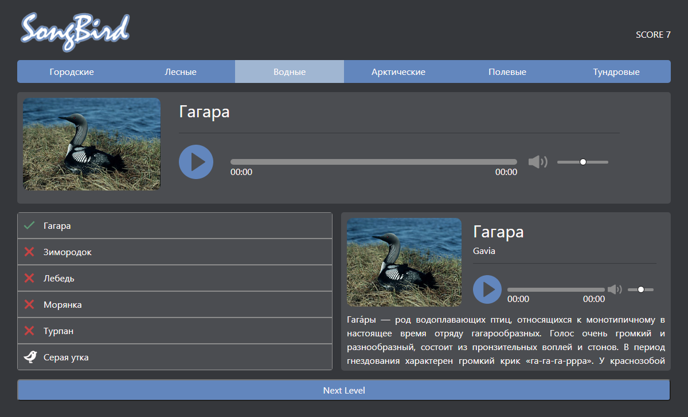

# 
Songbird is a one-page application for recognizing birds by their voices.

## On the project used:

### Frameworks:

- React
- Express

### Others: 

- React-Redux
- TypeScript
- Sass preprocessor for styling React components
- Self-developed REST API
- Node.js

### 
